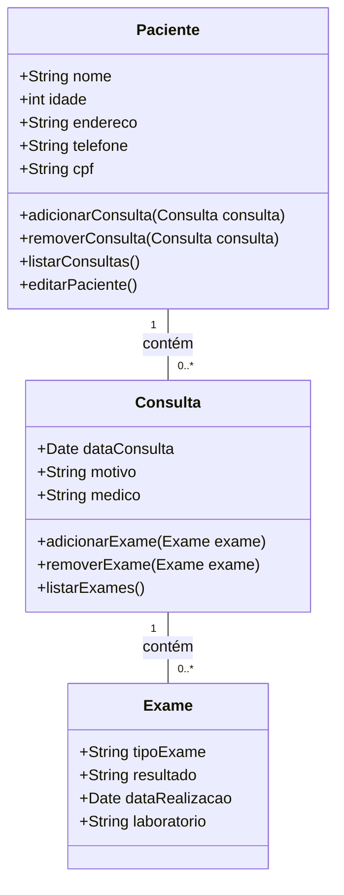

```mermaid
classDiagram
    class Paciente {
        +String nome
        +int idade
        +String endereco
        +String telefone
        +String cpf
        +adicionarConsulta(Consulta consulta)
        +removerConsulta(Consulta consulta)
        +listarConsultas()
        +editarPaciente()
    }

    class Consulta {
        +Date dataConsulta
        +String motivo
        +String medico
        +adicionarExame(Exame exame)
        +removerExame(Exame exame)
        +listarExames()
    }

    class Exame {
        +String tipoExame
        +String resultado
        +Date dataRealizacao
        +String laboratorio
    }

    Paciente "1" -- "0..*" Consulta : contém
    Consulta "1" -- "0..*" Exame : contém
```
